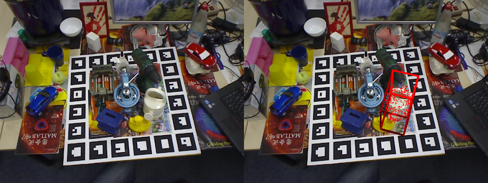

# OpenVINO Implement SAM6D E2E pipeline


## Getting Started

### 1. Preparation


#### 1.1 Prepare SAM6D repo
Please clone the repository locally:
```
git clone https://github.com/intel-sandbox/frameworks.industrial.motion-control.sam_6d_openvino
```
Install the environment 

```
cd frameworks.industrial.motion-control.sam_6d_openvino/SAM-6D
conda env create -f ov_environment.yaml
conda activate ov_sam6d
```
---

#### 1.2 Prepare OpenVINO environment 
Currently, To Enable SAM6D by OpenVINO, we provide two ways to prepare the OpenVINO environment: installing through the release package and compiling the OpenVINO source code for a specific version.

 - [OpenVINO source code compile install](#step-41-openvino-source-code-compile--ov-environment-setup), supporting deployment on Intel CPU & GPU.

 - [OpenVINO release package install](#step-31-openvino-install--ov-environment-setup), only support deployment on Intel CPU.

Before running SAM6D, please make sure the OpenVINO environment is ready.

```
cd ~/frameworks.industrial.motion-control.sam_6d_openvino/SAM-6D
sh ov_prepare.sh
```
---
#### Note: Modify `ov_prepare.sh` 
```bash
MODEL_PATH="<MODAL_SAVE_DIR>/fastsam_yolo_v8_predictor.xml"
```

Replace it with your actual model path, for example:
```bash
MODEL_PATH="/home/frameworks.industrial.motion-control.sam_6d_openvino/SAM-6D/Instance_Segmentation_Model/fastsam_yolo_v8_predictor.xml"
```
 
download the ISM model OV IR:
- [!!!] You need to manually modify MODEL_PATH="<MODAL_SAVE_DIR>/fastsam_yolo_v8_predictor.xml" in [ov_prepare.sh](./SAM-6D/ov_prepare.sh) to replace it with the actual path where fastsam_yolo_v8_predictor.xml was saved.
- The OpenVINO ISM IR model, you should download by manual:
  - descriptor_dinov2_model_infer.xml/.bin
  - fastsam_yolo_v8_predictor.xml/.bin
- The OpenVINO PEM provide model convert script [pem_model_convert_gpu.sh](./SAM-6D/Pose_Estimation_Model/pem_model_convert_gpu.sh) .You can run [step 4.2](#42-openvino-sam6d-pem-model-convert-for-gpu).
  
### 2. OpenVINO Evaluation SAM6D on the custom data
[!!!] Before running the script, ensure that the OV environment setup is complete. Please refer to OpenVINO [CPU](#3-optinal-openvino-enable-sam6d-pem-on-intel-cpu) / [GPU](#4-optinal-openvino-enable-sam6d-pem-on-intel-gpu) setting for details.
```
# set the paths
export PROJECT_ROOT=$(git rev-parse --show-toplevel)
export CAD_PATH=$PROJECT_ROOT/SAM-6D/Data/Example/obj_000005.ply    # path to a given cad model(mm)
export RGB_PATH=$PROJECT_ROOT/SAM-6D/Data/Example/rgb.png           # path to a given RGB image
export DEPTH_PATH=$PROJECT_ROOT/SAM-6D/Data/Example/depth.png       # path to a given depth map(mm)
export CAMERA_PATH=$PROJECT_ROOT/SAM-6D/Data/Example/camera.json    # path to given camera intrinsics
export OUTPUT_DIR=$PROJECT_ROOT/SAM-6D/Data/Example/outputs         # path to a pre-defined file for saving results

# run inference
cd SAM-6D
sh ov_demo.sh

# [Issue Fix] Imageio: 'libfreeimage-3.16.0-linux64.so' was not found on your computer; 
sudo apt-get update
sudo apt-get install libfreeimage-dev

```
### OV SAM6D Result Summary
Successfully enabled the SAM6D model by OpenVINO on Intel CPU / GPUs.
<p align="center">
  
</p>

***

### 3. (Optinal) OpenVINO enable SAM6D PEM on Intel CPU
Download OpenVINO packages from [OpenVINO Archives](https://storage.openvinotoolkit.org/repositories/openvino/packages/2025.2/linux)

#### step 3.1 OpenVINO install & OV environment setup
``` 
wget https://storage.openvinotoolkit.org/repositories/openvino/packages/2025.2/linux/openvino_toolkit_ubuntu22_2025.2.0.19140.c01cd93e24d_x86_64.tgz
tar -zxvf openvino_toolkit_ubuntu22_2025.2.0.19140.c01cd93e24d_x86_64.tgz

# Setup ov environment variables
source openvino_toolkit_ubuntu22_2025.2.0.19140.c01cd93e24d_x86_64/setupvars.sh
```

#### step 3.2 OpenVINO SAM6D-PEM model convert for CPU
OpenVINO custom op need to be compiled by source code, make sure the ov environment variables has already setup.
```
cd <SAM6D_DIR>/SAM-6D/Pose_Estimation_Model/model/ov_pointnet2_op/

mkdir build && cd build

cmake .. && make -j

cd <SAM6D_DIR>/SAM-6D/Pose_Estimation_Model

python pem_model_convert_cpu.py

```

***

### 4. (Optinal) OpenVINO enable SAM6D PEM on Intel GPU
The specific version of OpenVINO is required to support the SAM6D on Intel GPUs.
You must manually compile the OpenVINO source code and install it.
The following steps explain how to compile the source code and run the sam6d-SAM6D-PEM model using OpenVINO GPUs.
- OV spec repo : https://github.com/18582088138/xkd-openvino/tree/ov_sam6d_mix

#### step 4.1 OpenVINO source code compile & OV environment setup

OpenVINO source code build for linux reference doc :  https://github.com/openvinotoolkit/openvino/blob/master/docs/dev/build_linux.md
```
cd ~/
git clone -b ov_sam6d_mix https://github.com/18582088138/xkd-openvino

cd xkd-openvino

git submodule update --init --recursive

# (Optinal) Issue Fixed for openvino python API compiled
# pip install -r ./src/bindings/python/wheel/requirements-dev.txt
# sudo apt install patchelf

mkdir -p build && cd build

cmake -DCMAKE_BUILD_TYPE=Release -DENABLE_PYTHON=ON -DCMAKE_INSTALL_PREFIX=../ov_dist_mix  -DENABLE_WHEEL=ON -DENABLE_SYSTEM_TBB=OFF  -DENABLE_DEBUG_CAPS=ON -DENABLE_GPU_DEBUG_CAPS=ON  ..

make -j8
make install

# Setup ov environment variables
source ../ov_dist_mix/setupvars.sh

```

#### step 4.2 OpenVINO SAM6D-PEM model convert for GPU
OpenVINO custom op need to be compiled by source code, make sure the ov environment variables has already setup.
```
cd <SAM6D_DIR>/SAM-6D/Pose_Estimation_Model/model/ov_pointnet2_op/

mkdir build && cd build

cmake .. && make -j

cd <SAM6D_DIR>/SAM-6D/Pose_Estimation_Model

chmod 777 pem_model_convert_gpu.sh
./pem_model_convert_gpu.sh

```

***

### OV Enable Summary
Due to a SAM6D-PEM model struction refactor, the SAM6D-PEM inference script [run_inference_custom.py](./SAM-6D/Pose_Estimation_Model/run_inference_custom.py) in this branch no longer works. 

Please use run_inference_custom_pytorch.py for PyTorch CPU/CUDA inference.
            
Currently the refactor SAM6D-PEM model only supports model inference, not model training. 
If you need to retrain a model, pls use the original [SAM6D repository](https://github.com/JiehongLin/SAM-6D/tree/main).
This script will be removed in the future.

